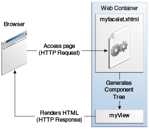
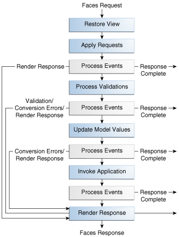

## O que é JSF (JavaServer Faces)

É um **framework MVC para a construção de interface de usuário, em aplicações web, no lado do servidor** 
(opostamente aos framworks atualmente populares, como Angular e React, que atuam com construção 
de interface de usuário no lado do cliente, isto é, no browser).

O framework **faz parte da especificação Java EE**.

Exemplos de **implementações**:
- Oracle Mojarra (referência)
- Apache MyFaces

Versão mais recente: 2.3 (Java EE 8).


### Referências
- https://javaee.github.io/javaserverfaces-spec/
- https://www.oracle.com/topics/technologies/jsf.html
---------------------------------------------------------------------------------------------------------------------------------
## Arquitetura JSF

Todas as requisições feitas pelo browser são atendidas por um único servlet embutido no framework, o **FacesServlet**.

    

A integração entre as camadas de **apresentação (View)** e de **dados (Model)**, isto é, a camada de **controle (Control)**, 
é facilitada pelo framework, o qual permite que métodos de um **bean gerenciado (managed bean)** 
sejam acessados na implementação da **view**.


### Referências
- https://www.oracle.com/topics/technologies/jsf.html
- https://www.devmedia.com.br/javaserver-faces/33272
---------------------------------------------------------------------------------------------------------------------------------
## Facelets

É a **linguagem declarativa para construção de páginas dentro do framework JSF** desde a versão 2.0 do framework,
utilizando arquivos **.xhtml**.

Com **Facelets**, é possível construir **templates** reutilizáveis para páginas inteiras ou componentes de interface.


### Referências
- https://docs.oracle.com/javaee/7/tutorial/jsf-facelets.htm
---------------------------------------------------------------------------------------------------------------------------------
## Árvore de Componentes

Toda **página HTML**, isto é, toda **view**, fornecida por uma aplicação JSF em resposta a uma requisição é gerada à partir
de uma **árvore de componentes**. Esta **árvore de componentes** é a representação **OO** em **run time** da definição da página, 
isto é, do seu **facelet (xhtml)**.



A **árvore de componentes** também armazena os *event handlers* e *validators* de cada componente.

A **árvore de componentes** de uma página sempre é salva no **FacesContext**, o qual persiste entre diferentes
requisições feitas para a aplicação. Deste modo, o framework consegue gerenciar automaticamente o estado dos componentes de interface.


### Referências
- https://docs.oracle.com/javaee/7/tutorial/jsf-intro001.htm
- https://docs.oracle.com/javaee/7/tutorial/jsf-facelets002.htm
- https://docs.oracle.com/javaee/7/tutorial/jsf-intro006.htm#BNAQQ
- https://www.devmedia.com.br/introducao-ao-facelets/5332
- https://javabeat.net/introduction-to-java-server-faces/
---------------------------------------------------------------------------------------------------------------------------------
## Ciclo de Vida JSF

Trata-se da sequência de fases seguidas pelo **FacesServlet** entre o recebimento de uma **requisição HTTP** e o fornecimento de
uma **resposta**. Aqui, tanto a **requisição** quanto a **resposta** dizem respeito a páginas web, isto é, 
o **cliente (browser) requere uma página** e o **servidor responde com uma página**.

O ciclo de vida de uma aplicação JSF é dividido em **seis fases** que se agrupam em: **execução** e **renderização**. Além disto,
todas as requisições feitas para a aplicação são divididas em: **inicial** e **subsequente (postback)**. As fases **2 a 5** são executadas somente para **requisições subsequentes (postback)**.

Uma requisição é considerada **inicial** quando é a **primeira requisição a uma determinada página da aplicação** durante
o *run time* vigente da aplicação. Em contrapartida, uma requisição é considerada **subsequente (postback)** quando a página sendo requerida já o foi ao menos uma vez durante o *run time* vigente da aplicação. 



As **seis fases do ciclo de vida** são executadas automaticamente pelo framework. Estas fases podem ser acessadas programaticamente em uma aplicação JSF por meio da implementação da interface **PhaseListener**. Caso haja necessidade de redirecionamento para outra aplicação ou a necessidade da geração de uma resposta que não contenha componentes JSF, então é possível acionar (manualmente/programaticamente) o método **responseComplete** do **FacesContext** para tal. 


### Execução

### Fase 1 - Restaurar Visão (Restore View)

Quando uma requisição de página chega para o **FacesServlet** este busca no **FacesContext** por uma
**árvore de componentes** associada ao nome da página sendo requerida. Caso encontre, trata-se de uma **requisição subsequente** e assim 
a **fase 2** é iniciada. 

Do contrário, trata-se de uma **requisição inicial** e assim uma **árvore de componentes** vazia é gerada. Em seguida, pula-se para a fase de **renderização**.


### Fase 2 - Aplicar Valores de Requisição (Apply Request Values)

Com a **árvore de componentes** restaurada, os **parâmetros da requisição** HTTP **são** decodificados e **atribuídos** aos seus respectivos
**componentes na árvore** (exemplo: valores inseridos pelo usuário nos componentes \<h:inputText\>). 

Caso algum componente tenha seu **atributo immediate** setado em *true*, então as validações e os eventos associados
ao componente serão todos processados nesta fase. 


### Fase 3 - Processar Validações (Process Validation)

Os **validators** registrados para os componentes na **árvore de componentes** são executados.

Caso alguma validação **falhe**, isto é, o componente tenha valor inválido, então uma mensagem de erro é adicionada ao **FacesContext**. 
Além disto, neste caso, **pula-se** para a **fase de renderização**, na qual o erro ocorrido será informado.


### Fase 4 - Atualizar Valores de Modelo (Update Model Values)

As **propriedades dos beans (backing beans)** associados aos componentes têm seus valores atualizados para os valores atuais dos componentes. Além disto, são feitas conversões, quando necessário, para que os valores possam ficar de acordo com os tipos de dados das **propriedades dos beans**.

Caso ocorra algum **erro** durante as conversões, **pula-se para a fase de renderização**, na qual o erro ocorrido será informado.


### Fase 5 - Invocar Aplicação (Invoke Application)

Os eventos de aplicação (exemplo de evento de aplicação: action de um commandButton) são então processados. 

É nesta fase que o código das regras de negócio de uma aplicação é executado.


### Renderização

### Fase 6 - Renderizar Resposta (Render Response)

Nesta fase, a **árvore de componentes** é salva no **FacesContext**.

Caso trate-se de uma **requisição inicial**, os componentes representados na página a ser renderizada serão adicionados à **árvore de componentes**. Em seguida, o motor de renderização é acionado.

Caso trate-se de uma **requisição subsequente**, o motor de renderização é acionado. 


### Referências
- https://docs.oracle.com/javaee/7/tutorial/jsf-intro003.htm
- https://docs.oracle.com/javaee/7/tutorial/jsf-intro006.htm#BNAQQ
- https://javabeat.net/life-cycle-of-jsf-components/
- https://javabeat.net/introduction-to-java-server-faces/
- https://roytuts.com/life-cycle-of-javaserver-faces-jsf/
- https://balusc.omnifaces.org/2006/09/debug-jsf-lifecycle.html
- https://stackoverflow.com/questions/8388854/how-to-implement-a-phaselistener-which-runs-at-end-of-lifecycle
---------------------------------------------------------------------------------------------------------------------------------
## @ManagedBean

Os **@ManagedBean** de uma aplicação JSF são gerenciados pelo **web container** (exemplo: Tomcat) ou **servidor de aplicação** (exemplo: TomEE, WebLogic).

Parâmetro **eager** em **@ManagedBean(eager = true)** faz com que o managed bean em questão seja inicializado
antes de qualquer tela. Muito pertinente quando o managed bean é injetado em outro managed bean, evitando-se assim que
algum método ou propriedade do managed bean injetado seja acessado antes do mesmo ter sido instanciado.

## Escopo de um @ManagedBean

#### @ApplicationScoped
Um **@ManagedBean** com este escopo existe enquanto a aplicação estiver rodando.

O bean é armazenado no contexto do Faces Servlet.


#### @SessionScoped
Um **@ManagedBean** com este escopo existe enquanto a sessão HTTP estiver válida.

O bean é armazenado num objeto de sessão do Faces Servlet. 


#### @ViewScoped
Um **@ManagedBean** com este escopo existe enquanto não se mudar de página.

O bean é destruído quando ocorre navegação para uma página diferente daquela na qual o bean foi criado.

Este escopo é o ideal para quando se utiliza ajax, mas não se muda de view, pois
assim consegue-se reter estado entre requisições HTTP.


#### @RequestScoped
Um **@ManagedBean** com este escopo existe enquanto um ciclo HTTP de requisição-resposta existir.

Assim, o **managed bean** é criado sempre que o **FacesServlet** recebe uma requisição e é destruído sempre que o **FacesServlet**
retorna a resposta para essa requisição.

Este é o escopo padrão de **@ManagedBean** quando não se declara explicitamente qual deve ser seu escopo.


### Referências
- https://balusc.omnifaces.org/2011/09/communication-in-jsf-20.html#ManagedBeanScopes
- https://docs.oracle.com/javaee/7/api/javax/faces/bean/ManagedBean.html
- https://respostas.guj.com.br/11541-qual-a-diferenca-entre-os-escopos-do-jsf----
- https://stackoverflow.com/questions/19322364/what-is-the-default-managed-bean-scope-in-a-jsf-2-application
- https://stackoverflow.com/questions/7031885/how-to-choose-the-right-bean-scope
---------------------------------------------------------------------------------------------------------------------------------
## Injeção de Dependência em um @ManagedBean

É realizada entre dois **@ManagedBean**. Requer que o @ManagedBean a ser injetado esteja em um **escopo maior ou igual** ao do
**@ManagedBean** que receberá a dependência. 

A injeção é feita por meio da anotação **@ManagedProperty("#{nomeDoManagedBean}")** conjuntamente com a **definição de um método setter**.

Exemplo

```java

@ManagedBean
@ApplicationScoped
public class FuncionalidadeRepository {
    // definições da classe
}

@ManagedBean
@ApplicationScoped
public class FuncionalidadeService {

    @ManagedProperty("#{funcionalidadeRepository}")
	private FuncionalidadeRepository funcionalidadeRepository;

    public void setFuncionalidadeRepository(FuncionalidadeRepository funcionalidadeRepository) {
    	this.funcionalidadeRepository = funcionalidadeRepository;
    }

    // outras definições da classe
}

@ManagedBean
@ViewScoped
public class FuncionalidadeMB {

    @ManagedProperty("#{funcionalidadeService}")
	private FuncionalidadeService funcionalidadeService;

    public void setFuncionalidadeService(FuncionalidadeService funcionalidadeService) {
		this.funcionalidadeService = funcionalidadeService;
	}
    
    // outras definições da classe
}
```

### Referências
- https://mkyong.com/jsf2/injecting-managed-beans-in-jsf-2-0/
- https://balusc.omnifaces.org/2011/09/communication-in-jsf-20.html#ManagedBeanScopes
- http://blog.triadworks.com.br/nao-misture-anotacoes-do-jsf-com-anotacoes-do-cdi
---------------------------------------------------------------------------------------------------------------------------------
## AJAX

À partir do JSF 2, o framework passa a oferecer suporte à AJAX de modo integrado, permitindo assim a comunicação entre front-end e back-end
sem haver a necessidade de se re-renderizar a página vigente quando o back-end responder.

Para se utilizar AJAX com JSF, é necessário que a página importe a biblioteca `xmlns:f="http://java.sun.com/jsf/core"` e que use
a tag `<f:ajax>` dentro de um componente JSF. Também é possível fazer ao contrário, isto é, uma tag `<f:ajax>` abrigar um conjunto
de componentes e assim um mesmo comportamento AJAX é disparado para cada um dos componentes desses.

A tag `<f:ajax>` suporta os seguintes atributos:

- disabled
  - Se igual a "true", o comportamento AJAX não será aplicado. Se igual a "false" (valor padrão), o comportamento AJAX será aplicado.

- event
  - Nome do tipo de evento para o qual se deseja aplicar AJAX. Exemplos: "click", "change", "keyup" (eventos DOM), "action", "valueChange" (eventos Faces). Quando não é  específicado, então o nome do evento padrão do componente em questão será automaticamente selecionado. Vale ressaltar que o componente dentro do qual se encontra a tag `<f:ajax>` deve ser compatível com o nome do tipo de evento escolhido para o atributo *event*.

- execute
  - Sequência de ids de componentes, ou de keywords, separados entre si por espaços, para os quais se deseja executar o comportamento AJAX conforme especificado pela tag `<f:ajax>` em questão. Por padrão, seu valor é "@this" e, portanto, trata-se do componente dentro do qual 
  a tag de `<f:ajax>` estiver inserida. Keywords: @this, @all, @none, @form. Exemplo: "@this idComponenteUm idComponenteDois".

- listener
  - Expressão com o nome do método Java que deve ser invocado quando houver o acionamento do comportamento AJAX. Exemplo: "#{managedBean.atualizarEndereco}". O método deve ser público, deve retornar void e pode ou não ter parâmetro ou ter um parâmetro de tipo `AjaxBehaviorEvent`.

- render
  - Sequência de ids de componentes, ou de keywords, separados entre si por espaços, os quais se deseja re-renderizar quando o evento AJAX for processado. Por padrão, seu valor é "@none". Keywords: @this, @all, @none, @form. Exemplo: "@this idComponenteUm idComponenteDois". 


Um mesmo componente JSF pode abrigar mais de uma tag `<f:ajax>` cada uma especificando um comportamento diferente caso se deseje.

Keyword | Descrição
------- | ---------
@this   | Componente que abriga a tag `<f:ajax>`
@all    | Todos os componentes da página
@form   | Todos os componentes do formulário que abriga a tag `<f:ajax>`
@none   | Nenhum componente


No exemplo a seguir, acrescenta-se a tag `<f:ajax>` a um componente `<h:inputText>`. Quando o valor do `<h:inputText>` mudar, uma requisição AJAX será feita e o componente de id "ola" será re-renderizado.

Por padrão, para componentes `<h:inputText>` o nome do tipo de evento para o qual uma requisição AJAX é disparada é o "valueChange" (mudança 
do valor do componente). Por isso que o atribute `event` da tag `<f:ajax>` está omitido.

```xhtml

<h:body>
    <h:form id="form">
        <h:inputText value="#{managedBean.nome}">
            <f:ajax render="ola"/>
        </h:inputText>
        <h:outputText id="ola" value="Olá #{managedBean.nome}"/>
    </h:form>
</h:body>

```

No pŕoximo exemplo, acrescenta-se a tag `<f:ajax>` a um componente `<h:commnandButton>`. Quando o `<h:commnandButton>`
for clicado, o formulário (inteiro) que incorporar o `<h:commnandButton>` será re-renderizado.

```xhtml

<h:body>
    <h:form id="form">
        <h:panelGrid id="testeFormGrid" columns="1">
            <h:column>
                <h:outputText value="Nome: " />
            </h:column>
            <h:column>
                <h:inputText value="#{testeMB.nome}" />
            </h:column>
        </h:panelGrid>
        
        <h:commandButton value="Limpar">
            <f:ajax render="@form" />
        </h:commandButton>
    </h:form>
</h:body>

```


No exemplo a seguir, acrescenta-se a tag `<f:ajax>` a um componente `<h:commnandButton>` com seu atributo `execute`
referenciando um componente `<h:inputText>`. Deste modo, ao se clicar no `<h:commnandButton>`, o comportamento AJAX estará 
baseado sobre os eventos ocorridos no componente `<h:inputText>` ao invés do componente `<h:commnandButton>`.

```xhtml

<h:body>
    <h:form id="form">
        <h:inputText id="nome" value="#{managedBean.nome}"/>
        <h:outputText id="ola" value="Olá #{managedBean.nome}"/>
        <h:outputText id="contador" value="#{managedBean.quantidadeCaracteres} caracteres digitados"/>

        <h:commandButton action="#{managedBean.transformar}" value="Transformar">
            <f:ajax render="ola contador" execute="nome"/>
        </h:commandButton>
    </h:form>
</h:body>

```


### Referências
- https://www.devmedia.com.br/utilizando-ajax-com-java-server-faces-jsf/24832
- https://www.beyondjava.net/a-comprehensive-guide-to-jsf-ajax
- https://docs.oracle.com/javaee/7/javaserver-faces-2-2/vdldocs-facelets/toc.htm
- Ebook "Java EE 7 Com JSF, Primefaces e CDI" por Thiago Faria. Segunda edição.
---------------------------------------------------------------------------------------------------------------------------------
### Actions Handlers e Action Listeners

Em JSF, eventos de interface de usuário como cliques em botões/links, alterações de valores de inputs, etc, 
são tratados no lado do servidor por meio de métodos em um **@ManagedBean**, apesar de serem eventos gerados no lado do cliente.

Tais eventos podem ser processados por **action handlers** e por **action listeners**.

Um **action handler** é um método sem parâmetros e que retorna uma String ou null. Se retornar null, a view não muda. Do contrário,
o framework redireciona para a view cujo nome é igual String retornada. Um **action handler** deve ser utilizado para processamento
de **lógica de negócio** e **navegação**.

```xhtml

<h:commandButton value="Entrar" action="#{managedBean.entrar}">

```

Um **action listener** é um método de um parâmetro do tipo **ActionEvent** e que retorna void. Por meio do seu parâmetro, o método
pode saber, por exemplo, qual foi o component que disparou o evento. Um **action listener** deve ser utilizado para processamento
de **lógica de interface de usuário**.

```xhtml

 <h:commandButton value="Checar" actionListener="#{managedBean.checar}" />

```

Também é possível definir um **action listener** por meio de uma classe separada ao invés de um método definido em um **ManagedBean**. 
Para tal, a classe deve implementar a interface **javax.faces.event.ActionListener** e deve ser chamada em uma view por meio da tag `<f:actionListener>`.

```xhtml

<h:commandButton value="Checar">
    <f:actionListener type="com.myapp.MyActionListener" />
</h:commandButton>

```

Nos exemplos anteriores, cada componente ou utilizava um atribute **action** ou um atributo **actionListener**. Entretanto, um mesmo
componente pode utilizar **ambos** os atributos.


### Referências
- https://johnderinger.wordpress.com/2007/10/10/action-handlers-and-event-listeners/
- https://mkyong.com/jsf2/jsf-2-actionlistener-example/
---------------------------------------------------------------------------------------------------------------------------------